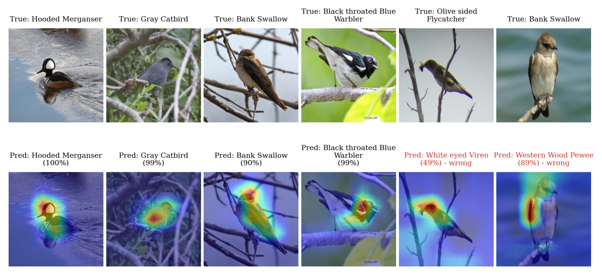
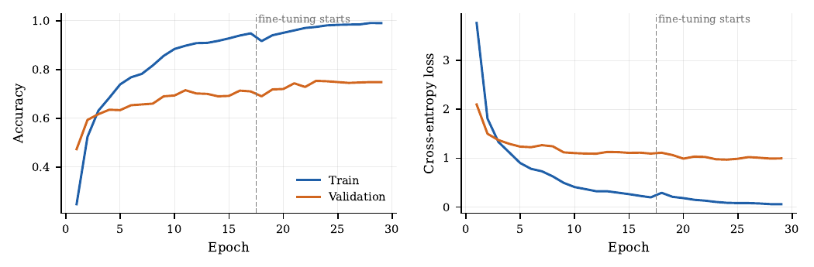
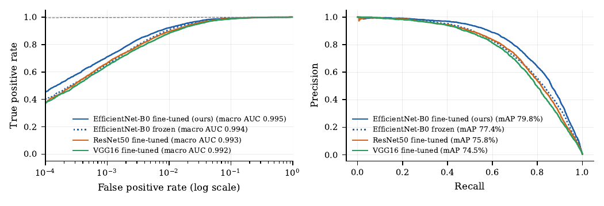

# Bird Species Identification with CNNs and Transfer Learning

Code and paper for **"A CNN-Based Bird Species Identification System for Biodiversity
Monitoring Using Transfer Learning"** (P. Nagasravanthi, L. Dileep Sai, K. Sagar,
Dept. of CSE, SRM University-AP).

The system classifies photographs of birds into the 200 species of
[CUB-200-2011](https://www.vision.caltech.edu/datasets/cub_200_2011/). Three
ImageNet-pretrained backbones (VGG16, ResNet50 and EfficientNet-B0) are trained
under an identical protocol. EfficientNet-B0 has the highest validation accuracy, so
it is the backbone of the proposed system. Every number, table and figure in the
paper is produced by `run_experiments.py` from real test-set predictions.


*Test images (top) and the system's predictions with Grad-CAM heat maps (bottom).
The last two columns are misclassifications.*

## Results

Results are on the official CUB-200-2011 test split (5,794 images, 200 species),
without bounding boxes or part annotations, at 224×224 input.

| Model | Val. top-1 | Test top-1 | Top-5 | Macro F1 | AUC | Params | CPU latency* |
|---|---|---|---|---|---|---|---|
| VGG16 | 67.8% | 68.8% | 90.6% | 69.0% | 0.992 | 15.4M | 609 ms |
| ResNet50 | 72.8% | 70.4% | 91.4% | 70.6% | 0.993 | 25.9M | 205 ms |
| **EfficientNet-B0 (proposed)** | **75.2%** | **73.1%** | **92.8%** | **73.2%** | **0.995** | **5.6M** | **64 ms** |
| VGG16, no augmentation | 68.5% | 68.8% | 89.3% | 68.8% | 0.992 | 15.4M | 609 ms |
| EfficientNet-B0, no augmentation | 75.2% | 74.8% | 93.0% | 74.8% | 0.994 | 5.6M | 65 ms |

\* Median time per single image on a 2-core Intel Xeon (2.20 GHz) CPU.

**Main findings**
- **EfficientNet-B0 is best on every accuracy metric** while being the smallest and fastest model.
- **Fine-tuning helps every backbone.** Over the frozen backbone, top-1 rises by +3.5 points (EfficientNet-B0), +8.1 (ResNet50) and +8.6 (VGG16).
- **Data augmentation did not improve accuracy.** Without it, VGG16 scores the same top-1, and EfficientNet-B0 scores 1.7 points higher on the test set with the same validation accuracy. The paper reports this openly.
- **The remaining errors are between look-alike species:** Common vs Arctic Tern, Caspian vs Elegant Tern, American Crow vs Common Raven, Acadian vs Least Flycatcher.

| Training curves (EfficientNet-B0) | ROC and precision–recall |
|---|---|
|  |  |

## Method

- **Data.** CUB-200-2011, official split. A stratified 10% of the training images is held out for validation, which gives 5,394 training, 600 validation and 5,794 test images.
- **Preprocessing and augmentation.** Images are resized to 224×224. During training they are randomly flipped, rotated (±15°), zoomed (±20%), and changed in brightness and contrast (±20%).
- **Model.** An ImageNet backbone feeds a global average pooling layer, then Dense(1024) with batch normalisation and ReLU, then dropout (0.5), then a 200-way softmax.
- **Training.**
  - Stage 1: the backbone is frozen and the head is trained with Adam at 1e-3.
  - Stage 2: the top of the backbone (EfficientNet-B0 stages 5–7, VGG16 blocks 4–5, ResNet50 conv4–conv5) is fine-tuned at 1e-4, with batch-normalisation layers kept frozen.
  - Both stages use early stopping on validation loss (patience 5) and halve the learning rate on plateau (patience 2).
- **Evaluation.** Top-1 and top-5 accuracy, macro precision, recall and F1, macro one-vs-rest AUC, mAP, per-species analysis, confusion matrix, and Grad-CAM.

## Repository layout

```
run_experiments.py        training, evaluation, tables, figures (one script)
requirements.txt
notebooks/colab_run.ipynb run everything on a free Google Colab GPU
paper/main.tex            the paper (IEEE conference format)
paper/generated/          results.tex, tables and figures produced by the script
assets/                   images used in this README
```

## Reproducing the results

**Google Colab (easiest).** Open `notebooks/colab_run.ipynb` in Colab, choose
*Runtime → Change runtime type → T4 GPU* and run the cells. Finished runs are saved to
Google Drive and skipped if you re-run, so a disconnect only loses the run in progress.

**Local machine** (NVIDIA GPU recommended; on Windows use WSL2):

```bash
pip install -r requirements.txt
python run_experiments.py --download        # downloads CUB-200-2011 (~1.1 GB), trains all 5 runs, writes paper/generated/
```

Useful options:

| Command | What it does |
|---|---|
| `--runs effnetb0` | train only the proposed model (`vgg16`, `resnet50`, `effnetb0`, `vgg16_noaug`, `effnetb0_noaug`) |
| `--report-only` | rebuild every table and figure from saved runs (no TensorFlow needed) |
| `--postprocess-only` | re-time all saved models and create the Grad-CAM figure (CPU is fine) |
| `--out DIR` | where runs are saved (default `experiment_outputs/`) |

To build the paper, compile `paper/main.tex` with pdfLaTeX (for example on Overleaf),
uploading it together with `paper/generated/`.

## Dataset

CUB-200-2011 is not included in this repository. The script downloads it from
Caltech, and its use is subject to the dataset's own terms. Please cite:

> C. Wah, S. Branson, P. Welinder, P. Perona, and S. Belongie, "The Caltech-UCSD
> Birds-200-2011 Dataset," California Institute of Technology, Tech. Rep.
> CNS-TR-2011-001, 2011.

## Citation

The paper is currently under submission. Please cite it as:

```bibtex
@misc{nagasravanthi2026birds,
  title  = {A CNN-Based Bird Species Identification System for Biodiversity Monitoring Using Transfer Learning},
  author = {Nagasravanthi, P. and Dileep Sai, L. and Sagar, K.},
  year   = {2026},
  note   = {Under submission. Code: https://github.com/dileepsai5607/bird-species-identification}
}
```
